<h3 align="center">👋 About Me</h3>

こんにちは！ソフトウェア開発と競技プログラミングに熱中している中学生です。 
Hi! I'm a junior high school student who loves software development and competitive programming.

- 🧑‍💻 **AtCoder:** 
- 🏎️ **Hobby:** MarioKart、Gadget
- 📱 **Device:** nubia Z80 Ultra
- 🔧 **Tool:** VSCode, Obsidian, Floorp, Proxmox

	
  

<h3 align="center">📊 My GitHub Stats</h3>

	

---

<h3 align="center">🛠️ Skills</h3>
<h4 align="center">Programming Languages</h4>

	
  

<h4 align="center">Framework</h4>

	
  

<h4 align="center">DevOps</h4>

	
  

<h4 align="center">Tools / Platforms</h4>

	
  

	

<h3 align="center">💼 Experience</h3>

- Google Al Essentials 修了
- [電子電脳技術研究会](https://github.com/tsukuba-denden) 責任者
- セキュリティ・キャンプ2025 ジュニア 修了
- グローバル消費インテリジェンス寄附講座(GCI) 2025 Summer 修了
- DL基礎 修了

<h3 align="center">🔗 Connect with me</h3>

<!-- 開発者系 -->

	
	
	
	
	
	
	

<!-- SNS系 -->

	
	
	
	
	
	
	
	
	
	
	
	
	
	

<!-- その他 -->

	
	
	
	
	

	

<h3 align="center">📊 Else statistics</h3>

	

	

	

<!---->

<!---->
<!---->
<!---->
<!---->
